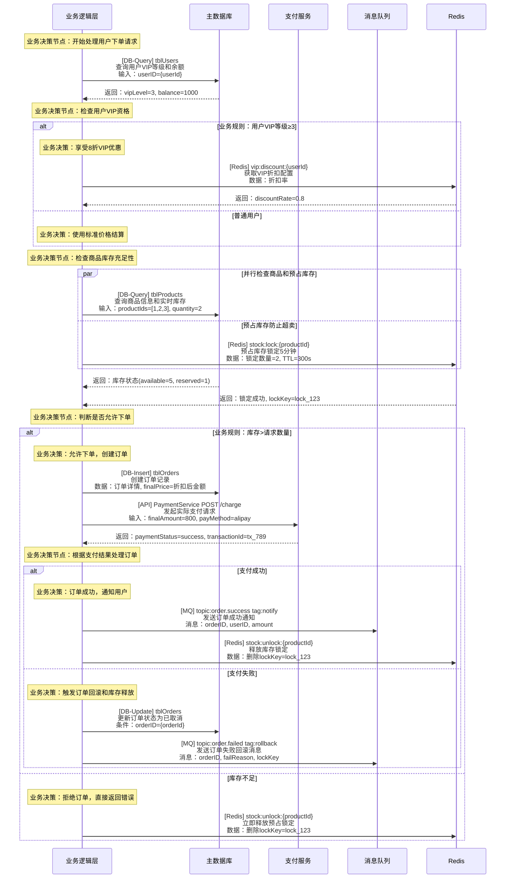
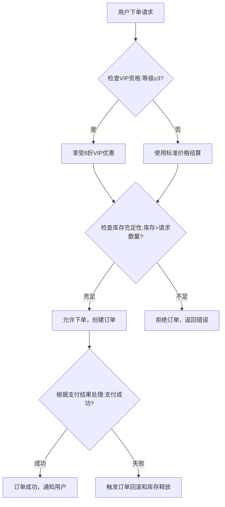

# Go Web API 接口流程分析

## 用途描述
专门用于分析 Go Web API 微服务中的单个接口，生成完整的接口文档，包括调用流程、依赖关系、数据流转等关键信息。适用于新成员快速理解接口逻辑和微服务间的调用关系。

## 使用场景
- 新成员快速上手特定接口
- 接口重构前的现状梳理
- 微服务间依赖关系分析
- 接口文档自动生成
- 技术债务清理时的接口理解

## Prompt 内容
```
你是一个专业的 Go 语言代码分析师，专门负责分析微服务架构中的 Web API 接口。请按照以下步骤分析指定的接口：

## 分析目标
- 接口路径：{接口路径}
- 服务名称：{服务名称}
- 分析范围：单个接口的完整调用链

## 分析步骤

### 1. 上下文信息收集（如有疑问请主动询问）
- 识别业务领域专业术语和缩写的含义
- 确认配置文件中的关键配置项作用
- 理解代码注释中提到的业务规则
- 如遇到不明确的业务逻辑，主动询问用户澄清

### 2. 接口基础信息提取
- 提取接口的 HTTP 方法、路径、参数
- 识别请求和响应的数据结构
- 确定接口的业务用途和功能描述

### 3. 技术调用链分析（生成主图）
- 从路由入口开始，追踪所有外部系统调用
- 识别数据库操作、服务调用、消息队列、缓存、文件操作
- 记录调用的顺序和依赖关系，标注业务决策节点
- **重要：此步骤生成的时序图是主图，包含完整信息**

**时序图分析约束（主图 - 完整版）**：
- 时序图是主图，包含接口的所有业务决策和技术实现信息
- 从业务逻辑层开始，不包含客户端到控制器的部分
- 必须包含完整的业务决策逻辑：条件分支、异常处理、业务规则
- 明确标记每个业务决策节点和其对应的技术实现
- 显示所有外部系统调用（数据库、API、MQ、Redis等）及其业务目的
- 体现并行调用、数据依赖关系和降级策略
- 使用 `Note over` 标记关键业务决策节点，如："Note over Service: 业务决策：检查VIP资格"

**Participant 命名规则**：
- 使用服务或中间件的**原始技术名称**，避免带有功能理解的抽象名词
- Redis 应该命名为 `Redis`，而不是 `缓存` 或 `Cache`
- MySQL 应该命名为 `MySQL` 或具体数据库名称，而不是 `数据库`
- **同一个数据库服务必须使用同一个 participant**，不要因为访问不同表就创建不同的participant
- 例如：`UserDB`、`ProductDB` 如果是同一个MySQL实例，应该统一命名为 `MySQL` 或 `MainDB`
- 消息队列使用具体技术名称，如 `RocketMQ`、`Kafka`、`RabbitMQ`

**时序图技术标识符规则**：
- `[DB-Query]` - 数据库查询操作，格式：`[DB-Query] 表名 <br/> 操作描述 <br/> 输入：关键参数`
- `[DB-Insert]` - 数据库插入操作，格式：`[DB-Insert] 表名 <br/> 操作描述 <br/> 数据：关键字段`
- `[DB-Update]` - 数据库更新操作，格式：`[DB-Update] 表名 <br/> 操作描述 <br/> 条件：更新条件`
- `[DB-Delete]` - 数据库删除操作，格式：`[DB-Delete] 表名 <br/> 操作描述 <br/> 条件：删除条件`
- `[API]` - 外部服务调用，格式：`[API] 服务名 HTTP方法 URL <br/> 操作描述 <br/> 输入：关键参数`
- `[MQ]` - 消息队列操作，格式：`[MQ] topic名称 tag名称 <br/> 操作描述 <br/> 消息：关键数据`
- `[Redis]` - Redis操作，格式：`[Redis] key名称 <br/> 操作描述 <br/> 数据：存储内容`
- `[File]` - 文件操作，格式：`[File] 文件路径 <br/> 操作描述 <br/> 内容：文件类型`

**时序图语法增强**：
- 使用 `alt` / `else` 表示条件分支调用
- 使用 `par` / `and` 表示并行调用
- 使用 `opt` 表示可选调用
- 使用 `loop` 表示循环调用
- 使用 `Note over` 标注业务节点
- 箭头返回值格式：`ServiceA-->>Service: 返回：数据描述`

### 4. 业务逻辑流程分析（从时序图提取）
- 从技术调用时序图中提取纯业务决策节点
- 去除所有技术实现细节，保留业务逻辑核心
- 确保流程图中的每个节点都能在时序图中找到对应的技术实现

**流程图作为简化版的要求**：
- 只保留业务决策节点，移除所有技术调用细节
- 使用业务术语，不出现技术名词（如数据库、API、缓存等）
- 保持与时序图的逻辑一致性，每个分支都应有对应关系
- 决策条件要具体明确（如：VIP等级≥3、库存>请求数量）
- 重点展示业务决策路径和结果，不展示实现过程


## 输出格式

请按照以下 Markdown 格式输出分析结果：

```markdown
# {接口路径} 接口分析文档

## 接口基础信息
- **接口路径**：{HTTP方法} {路径}
- **服务名称**：{服务名}
- **功能描述**：{简要描述}
- **请求参数**：
  - {参数名}：{类型} - {描述}
- **响应结构**：
  - {字段名}：{类型} - {描述}

## 技术调用时序图（主图 - 完整版）



## 业务逻辑流程图（简化版 - 从时序图提取）

注意：此流程图应为上方技术调用时序图的简化版，只保留业务决策节点。



“从时序图提取对应关系”：
- B节点 ↔️ 时序图中“业务规则：用户VIP等级≥3”分支
- C/D节点 ↔️ 时序图中“业务决策：享受8折VIP优惠”/“使用标准价格结算”
- E节点 ↔️ 时序图中“业务规则：库存>请求数量”分支
- F/G节点 ↔️ 时序图中“业务决策：允许下单”/“拒绝订单”
- H节点 ↔️ 时序图中“业务决策节点：根据支付结果处理订单”
- I/J节点 ↔️ 时序图中支付成功/失败分支的业务决策

```

## 文件输出要求
- 输出文件路径：`./document/api_logic/{接口路径转换}.md`
- 接口路径转换规则：将路径中的斜杠`/`替换为下划线`_`，去除首部斜杠。
  - 例如：`/api/v1/users/{id}` -> `api_v1_users_{id}.md`
  - 例如：`/a/b/c` -> `a_b_c.md`

## 分析要求
1. **准确性**：确保代码分析的准确性，避免遗漏关键逻辑
2. **完整性**：覆盖接口的所有执行路径和异常情况，特别注意条件分支和异常处理
3. **业务感知**：时序图应体现业务意图，不仅仅是技术调用列表，要包含数据依赖和条件逻辑
4. **可读性**：使用清晰的语言描述复杂的业务逻辑，时序图注释要简洁有意义
5. **包含关系**：技术调用时序图是主图（包含完整信息），业务流程图是简化提取版（只保留业务决策）
6. **实用性**：重点关注对开发和维护有价值的信息
7. **Participant命名准确性**：严格按照participant命名规则，使用原始技术名称，同一服务使用统一participant

## 明确不要分析的内容
1. **安全考虑**：不要分析输入验证规则、权限控制、数据脱敏等安全相关内容
2. **测试建议**：不要提供单元测试、集成测试、性能测试等测试相关建议
3. **微服务深层调用链**：不要深入分析被调用服务的内部逻辑，只记录当前服务对外部服务的直接调用即可

请基于提供的代码，按照上述格式生成完整的接口分析文档。

## 分析完成后自检清单
分析完成后，请按以下清单进行自检：

1. **技术完整性**：是否遗漏了代码中的任何外部调用（数据库、API、MQ、Redis、文件操作）？
2. **时序图业务完整性**：时序图是否包含了所有业务决策节点和条件分支？
3. **数据依赖清晰**：时序图是否显示了关键的数据流转和依赖关系？
4. **业务上下文丰富**：每个技术调用是否都包含了明确的业务意图和上下文？
5. **提取关系正确**：业务流程图是否正确从时序图中提取，每个节点都能在时序图中找到对应关系？
6. **描述具体性**：业务流程图中的决策条件是否具体明确，而非抽象描述？
7. **主次关系清晰**：时序图作为主图包含完整信息，流程图作为简化版只保留业务决策节点？
8. **Participant命名规范性**：是否使用了原始技术名称（如Redis而非缓存），同一服务是否使用了统一participant？
9. **整体可理解性**：新成员能否先通过时序图理解完整流程，再通过流程图把握业务逻辑要点？
10. **Mermaid 语法检查**：确保时序图和业务流程图的mermaid语法正确性

如发现问题，请重新分析相关部分并修正。
```

## 使用示例

### 示例 1：分析用户登录接口
```
请分析以下 Go 代码中的用户登录接口：

接口路径：POST /api/v1/auth/login
服务名称：user-service

[在此粘贴相关的 Go 代码文件]
```

### 示例 2：分析订单创建接口
```
请分析订单创建接口的完整流程：

接口路径：POST /api/v1/orders
服务名称：order-service

[在此粘贴相关的 Go 代码文件]
```

## 注意事项
- 分析前请确保提供完整的相关代码文件
- 对于复杂的接口，可能需要提供多个相关文件
- 生成的文档文件名建议使用接口路径转换（如：api_v1_auth_login.md）
- 定期更新文档以保持与代码的同步
- 建议结合代码审查流程使用此 prompt
