# 时序图驱动的业务理解与AI协作开发方法

通过时序图可视化让AI精确理解业务逻辑，实现高质量的需求到代码转换。

## 🎯 系统概览

一个融合**时序图驱动理解**和**Agent协作执行**的AI开发系统，实现：

- 🔍 **时序图驱动理解**：通过可视化接口逻辑让AI深度理解业务流程
- 🤖 **Agent智能协作**：专业化Agent生态系统提供从需求到代码的全流程服务
- ✅ **精确影响分析**：基于时序图识别变更影响范围
- 🧪 **智能测试生成**：依据业务逻辑流程自动生成全面测试用例
- 🚀 **AI主导开发**：从分析到编码的完整AI工作流，人工专注质量把控

## 🏗️ 系统架构：AI-人工协作模式

### 核心理念

本系统基于**时序图驱动AI理解**的核心理念，让AI通过可视化的接口逻辑分析深度理解项目架构和业务流程，从而实现高质量的需求到代码转换。采用**AI主导开发，人工质量把控**的协作模式。

### AI-人工协作流程图

```mermaid
flowchart LR
    A[项目初始化阶段] --> B[🤖 AI扫描项目所有API接口]
    B --> C[🤖 Agent自动生成API分析文档]
    C --> D[🤖 构建API接口知识库]
    
    D --> E[👤 新需求输入]
    E --> F[🤖 需求影响分析<br/>识别受影响的接口]
    F --> G[👤 人工确认影响范围]
    
    G --> H[🤖 更新时序图和流程图]
    H --> I[🤖 生成代码实现]
    I --> J[🤖 生成测试用例]
    
    J --> K[👤 代码审查Review]
    K --> L{审查结果}
    L -->|通过| M[👤 执行测试验证]
    L -->|需修改| H
    
    M --> N{测试结果}
    N -->|通过| O[👤 部署上线]
    N -->|失败| P[👤 问题分析]
    P --> H
    
    O --> Q[🤖 更新API文档和知识库]
    Q --> R[开发周期完成]
    
    style A fill:#e1f5fe
    style E fill:#fff3e0
    style H fill:#f3e5f5
    style I fill:#e8f5e8
    style K fill:#fce4ec
    style O fill:#f1f8e9
```



### 详细实施步骤

#### 阶段一：🤖 AI主导 - API知识库构建

**目标**：AI为项目中每个API建立详细的逻辑分析文档

1. **🤖 API发现**：AI扫描项目代码，识别所有对外接口
2. **🤖 自动化分析**：使用项目分析Agent为每个API生成分析文档
   - 文件名格式：`api-analysis/{api_path}.md`
   - 内容结构参考：[api_analyze_demo.md](api_analyze_demo.md)
3. **🤖 知识库建立**：构建结构化的API接口知识库

**AI输出物**：
- 完整的API分析文档集合
- 项目接口依赖关系图
- 服务间调用时序图总览

#### 阶段二：🤖+👤 协作 - 需求影响分析

**目标**：精确识别新需求对现有接口的影响范围

1. **👤 需求输入**：人工提供业务需求或功能变更描述
2. **🤖 接口影响分析**：
   - AI基于时序图自动识别可能受影响的API接口
   - AI分析数据流和服务依赖关系
   - AI生成影响范围报告和风险评估
3. **👤 人工确认**：技术负责人确认分析结果的准确性

**协作输出物**：
- 🤖 受影响接口清单（AI生成）
- 🤖 变更风险评估报告（AI分析）
- 👤 确认的实施方案（人工决策）

#### 阶段三：🤖 AI主导 - 设计更新

**目标**：AI通过可视化图表设计新的业务逻辑流程

1. **🤖 时序图更新**：
   - AI修改受影响接口的技术时序图
   - AI添加新的服务调用关系
   - AI标注关键业务决策节点
2. **🤖 流程图设计**：
   - AI更新业务流程图
   - AI简化复杂逻辑为清晰的决策流
3. **🤖 逻辑说明**：AI详细描述关键业务逻辑变更点

**AI输出物**：
- 更新的时序图和流程图
- 详细的逻辑变更说明
- 接口调用示例更新

#### 阶段四：🤖 AI主导 - 代码实现

**目标**：AI将设计转化为可执行的代码和测试

1. **🤖 代码实现**：
   - AI识别需要修改的具体代码文件
   - AI生成完整的代码实现
   - AI处理数据库变更脚本
2. **🤖 测试生成**：
   - AI基于时序图生成单元测试用例
   - AI设计集成测试场景
   - AI创建端到端测试流程

**AI输出物**：
- 完整的代码实现
- 全面的测试用例套件
- 数据库变更脚本

#### 阶段五：👤 人工主导 - 质量把控与部署

**目标**：人工审查AI成果并负责生产部署

1. **👤 代码审查**：
   - 人工Review AI生成的代码质量
   - 验证业务逻辑的正确性
   - 确认代码符合项目规范
2. **👤 测试执行**：
   - 运行AI生成的测试用例
   - 验证功能完整性和性能指标
   - 进行必要的补充测试
3. **👤 部署上线**：
   - 人工负责生产环境部署
   - 监控系统运行状态
   - 处理部署过程中的问题
4. **🤖 文档更新**：AI同步更新API分析文档和知识库

**协作输出物**：
- 👤 审查通过的生产代码
- 👤 测试执行报告
- 🤖 更新的项目文档

### 核心优势

#### 🎯 **精确理解**
时序图提供完整的业务和技术上下文，确保AI准确理解复杂的接口逻辑关系

#### 🔄 **可视化驱动**
用图表而非文字描述驱动开发，减少理解偏差和沟通成本

#### 📚 **知识积累**
为每个API建立详细的分析文档，形成项目的活知识库

#### 🛠️ **精确变更**
基于时序图的影响分析，确保变更的完整性和准确性

#### 🚀 **高效协作**
统一的文档格式和开发流程，提升团队协作效率

### 🤖 AI执行层：专业化Agent生态系统

基于时序图理解基础，AI Agent生态系统协作完成从分析到编码的全流程。系统采用**核心能力导向**而非固定数量的Agent架构：

#### 核心AI能力模块

| 能力领域 | 时序图驱动的核心能力 | 具体AI执行任务 | 输入来源 | 输出AI成果 |
|---------|---------------------|-------------|----------|----------|
| **项目分析** | **基于代码生成时序图** | 扫描API、生成接口分析文档、构建知识库 | 项目代码库 | API时序图库、依赖关系图 |
| **变更分析** | **基于时序图分析影响范围** | 识别受影响接口、评估变更风险、生成实施方案 | 需求+时序图库 | 影响分析报告、风险评估 |
| **设计实现** | **时序图驱动的设计到代码转换** | 更新时序图、生成代码实现、创建测试用例 | 影响分析+时序图 | 更新的时序图、完整代码、测试套件 |

#### Agent架构特点

- **🧩 模块化设计**：每个能力模块可独立运行或协作执行
- **🔄 动态组合**：根据项目复杂度和需求动态调整Agent协作模式
- **📈 可扩展性**：支持为特定技术栈或业务场景添加专门的Agent
- **🎯 能力导向**：专注于核心能力实现，而非固定的Agent数量

### 👤 人工质量把控层

人工专注于关键的质量把控和生产部署环节：

- 👤 **代码审查**：Review AI生成代码的质量和逻辑正确性
- 👤 **测试执行**：运行AI测试用例，验证功能完整性
- 👤 **部署上线**：负责生产环境部署和系统监控
- 👤 **问题决策**：处理复杂业务变更和系统级决策

## 🚀 AI-人工协作工作流示例

### 场景："为用户登录添加多因素认证"

#### 阶段1：🤖 项目分析Agent - 项目初始化
```yaml
# AI自动执行
api_discovery:
  current_auth_apis:
    - "POST /auth/login" # 现有登录接口
    - "POST /auth/register" # 用户注册接口
    - "GET /auth/profile" # 用户资料接口
  
  generated_analysis:
    - file: "api-analysis/auth_login.md"
      content: "登录接口时序图和业务流程分析"
    - file: "api-analysis/auth_profile.md" 
      content: "用户资料接口时序图分析"
```

#### 阶段2：🤖+👤 需求影响分析
```yaml
# 人工输入需求
human_input:
  requirement: "为用户登录添加多因素认证功能"
  
# AI分析影响
ai_impact_analysis:
  affected_apis:
    - "/auth/login" # 需要增加MFA验证步骤
    - "/auth/profile" # 需要添加MFA设置选项
  new_apis_needed:
    - "POST /auth/mfa/setup" # MFA设置接口
    - "POST /auth/mfa/verify" # MFA验证接口
  risk_assessment: "中等风险 - 影响核心认证流程"

# 人工确认
human_confirmation: "确认影响分析正确，继续执行"
```

#### 阶段3：🤖 设计实现Agent
```yaml
# AI更新时序图设计
updated_sequence_diagrams:
  login_with_mfa:
    participants: [User, AuthController, MFAService, Database]
    new_steps:
      - "验证用户名密码"
      - "检查MFA是否启用"
      - "如启用，要求MFA验证"
      - "验证TOTP令牌"
      - "完成登录"
      
  mfa_setup:
    participants: [User, ProfileController, MFAService, Database]
    steps:
      - "生成MFA密钥"
      - "生成二维码"
      - "用户扫码设置"
      - "验证首次令牌"
      - "保存MFA配置"
```

#### 阶段4：🤖 设计实现Agent - 代码生成
```typescript
// AI自动生成的代码实现
// src/controllers/AuthController.ts
async login(req: Request, res: Response) {
  const { username, password } = req.body;
  
  // 验证用户名密码
  const user = await UserService.authenticate(username, password);
  if (!user) return res.status(401).json({ error: 'Invalid credentials' });
  
  // 检查MFA是否启用
  if (user.mfa_enabled) {
    const { token } = req.body;
    if (!token) {
      return res.status(200).json({ 
        mfa_required: true,
        message: 'MFA token required' 
      });
    }
    
    // 验证MFA令牌
    const mfaValid = await MFAService.validateToken(user.id, token);
    if (!mfaValid) {
      return res.status(401).json({ error: 'Invalid MFA token' });
    }
  }
  
  // 生成JWT令牌
  const jwt = TokenService.generateToken(user);
  res.json({ token: jwt, user: user.profile });
}
```

#### 阶段5：🤖 设计实现Agent - 测试生成
```javascript
// AI自动生成的测试用例
describe('MFA Login Flow', () => {
  it('should require MFA token when user has MFA enabled', async () => {
    const user = await createTestUser({ mfa_enabled: true });
    
    // 第一次登录请求 - 只提供用户名密码
    const response1 = await request(app)
      .post('/auth/login')
      .send({ username: 'test', password: 'password' });
      
    expect(response1.status).toBe(200);
    expect(response1.body.mfa_required).toBe(true);
    
    // 第二次登录请求 - 提供MFA令牌
    const token = speakeasy.totp({ secret: user.mfa_secret });
    const response2 = await request(app)
      .post('/auth/login')
      .send({ 
        username: 'test', 
        password: 'password',
        token: token 
      });
      
    expect(response2.status).toBe(200);
    expect(response2.body.token).toBeDefined();
  });
});
```

#### 阶段6：👤 人工质量把控
```yaml
# 人工代码审查
code_review:
  reviewer: "Senior Developer"
  status: "APPROVED with minor changes"
  feedback:
    - "MFA密钥存储需要加密处理"
    - "添加速率限制防止暴力破解"
    - "错误消息需要更安全的处理"

# 人工测试执行  
test_execution:
  unit_tests: "✅ 98% coverage - PASSED"
  integration_tests: "✅ All scenarios - PASSED" 
  security_tests: "✅ No vulnerabilities - PASSED"
  performance_tests: "✅ <200ms response - PASSED"

# 人工部署
deployment:
  environment: "Production"
  status: "SUCCESS"
  rollout_strategy: "Blue-Green deployment completed"
  monitoring: "All metrics normal after 24h"
```


## 🎮 使用指南

### 面向业务利益相关者

1. **提交需求**：提供业务上下文和用户故事
2. **审查可视化**：交互式业务流程图展示您的需求
3. **验证实现**：确认技术解决方案满足业务需求
4. **跟踪进度**：系统提供完整的进度跟踪

### 面向产品经理

1. **需求细化**：结构化需求获取与验收标准
2. **影响分析**：准确了解哪些系统和代码将受到影响
3. **时间规划**：理解技术复杂性和依赖关系
4. **质量保证**：验证业务规则得到适当测试

### 面向开发团队

1. **技术规范**：详细实现计划，包含确切代码位置
2. **架构指导**：服务交互和数据流图
3. **代码生成**：自动化测试用例和文档
4. **部署自动化**：完整CI/CD管道配置

### 面向DevOps团队

1. **基础设施规划**：Terraform和Kubernetes配置
2. **部署编排**：蓝绿部署与回滚程序
3. **监控设置**：业务和技术指标的全面可观测性
4. **安全集成**：自动化安全扫描和合规验证

## 🔧 快速开始

### 开发流程快速启动

1. **🤖 API分析阶段**：运行项目分析Agent扫描项目，生成时序图知识库
2. **👤+🤖 需求输入**：人工提供业务需求，AI进行影响分析  
3. **🤖 设计生成**：AI自动更新时序图和生成代码实现
4. **👤 质量把控**：人工审查代码并执行测试验证
5. **👤 部署上线**：人工负责生产环境部署和监控

### AI-人工协作模式

```yaml
# 时序图驱动的AI理解开发
核心理念: 时序图作为AI理解业务逻辑的基础
AI负责: 分析 → 设计 → 编码 → 测试生成
人工负责: 需求确认 → 代码审查 → 测试执行 → 生产部署

# 协作优势
- AI处理重复性分析和编码工作
- 人工专注于关键决策和质量把控  
- 基于时序图的精确理解确保代码质量
- 完整的开发生命周期自动化
```

## 🎯 系统价值

### 对开发效率的提升
- **🚀 加速开发**：AI驱动的分析到编码流程，减少80%重复工作
- **🎯 精确变更**：基于时序图的影响分析，避免遗漏和错误  
- **🧪 全面测试**：AI自动生成覆盖业务逻辑的完整测试套件
- **📚 知识积累**：项目API的活文档库，便于维护和新人上手

### 对代码质量的保障
- **🔍 深度理解**：时序图驱动让AI准确理解复杂业务逻辑
- **👥 人工把关**：关键环节的人工审查确保代码质量
- **⚡ 快速迭代**：标准化流程支持敏捷开发和持续交付
- **🛡️ 风险控制**：系统化的影响分析和测试验证降低变更风险

## 🛠️ 高级特性

### 自动化代码生成
AI能力模块可以生成：
- **单元测试**：基于代码分析和业务需求
- **集成测试**：服务交互测试
- **API文档**：带示例的OpenAPI规范
- **数据库迁移**：带回滚脚本的模式变更
- **基础设施代码**：Terraform/CloudFormation模板
- **监控仪表板**：Grafana/DataDog配置

### 业务技术对齐
系统确保技术实现服务于业务目标：
- 每个代码变更都映射到业务价值
- 技术债务通过结构化分析可见
- 业务指标自动检测
- 合规要求内置到开发过程中

## 🎨 定制化

### 适配您的组织

1. **流程定制**：调整工作流以适应您的开发流程
2. **能力扩展**：为特定技术栈定制专门的AI能力模块
3. **工作流集成**：与现有JIRA、GitHub、Slack工作流集成
4. **合规扩展**：添加组织特定的合规要求


## 🤝 贡献

该系统设计用于随组织需求演进。主要贡献领域：
- **新AI能力**：扩展现有能力模块或创建专门化功能
- **集成模块**：连接更多工具和平台
- **流程优化**：支持新的开发模式和架构
- **模板和示例**：分享成功的实现模式

## 📚 额外资源

- **[AI能力文档](.)**：每个AI能力模块的详细指南
- **[集成示例](examples/)**：真实世界的实现场景  
- **[故障排除指南](troubleshooting.md)**：常见问题和解决方案

---

**🚀 准备好转型您的开发流程了吗？**

从项目分析开始构建您的时序图知识库，或者如果您有具体需求要实现，请深入了解变更分析和设计实现流程。

企业开发的未来：**既懂业务又会编码的AI助手。**