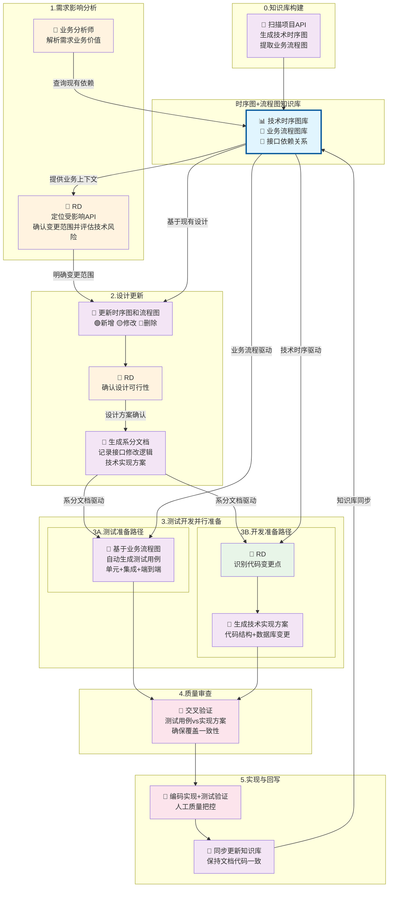

# 基于时序图的AI-人工协作开发方法

一种以“图”为中心，AI主导分析与设计、人工把控质量与落地的轻量协作方法论。

- **核心理念**：用技术时序图让AI精准理解，实现从需求到代码的可视化落地；用业务流程图让人快速校验价值与边界。
- **协作分工**：AI做“重分析、快生成”，人工做“定方向、控质量、审查与合入”。
- **变更可控**：以图为基，先评估影响再动代码，全过程留痕可追溯。

## 核心：双层图表知识库

- **技术时序图层**（给开发与AI）
  - 描述 API 调用序列、服务交互、数据流转、异常处理
  - 用于代码生成、影响分析与测试设计
- **业务流程图层**（给业务与产品）
  - 描述业务规则、决策与用户旅程
  - 用于需求澄清、场景覆盖与验收校对
- **协同机制**
  - 流程图抽象业务意图，时序图落实技术实现
  - 任何变更同时更新两层图，保持需求与实现的一致性

## 协作开发流程图

## 实施步骤（精简版）

- **阶段0｜知识库构建（AI）**：扫描项目 → 生成 API 分析、时序图与流程图 → 建立接口依赖关系
- **阶段1｜需求影响分析（AI+人）**：基于图识别受影响 API/数据流/服务依赖 → 生成影响与风险报告 → 人工确认
- **阶段2｜设计更新（AI）**：同步更新两层图，标注新增/修改/删除 → 生成简明系分文档与实现要点
- **阶段3｜并行准备（AI+人）**：
  - 测试：按流程图与时序图生成单元/集成/E2E 用例
  - 开发：明确变更点与DB变更，生成实现方案与接口契约
- **阶段4｜质量审查（人）**：用“测试用例 vs 实现方案 vs 图”三方交叉验证覆盖与一致性
- **阶段5｜实现与回写（人+AI）**：编码与测试 → AI回写文档与图，保持“图-文-码”一致

## 关键交付物

- 图：更新后的技术时序图、业务流程图、接口依赖关系
- 文：影响分析与风险评估、简明系分文档、实现方案要点
- 测：覆盖完整的测试用例（单元/集成/E2E）与执行报告
- 码：经审查的生产代码与必要的数据库变更脚本

## 快速开始

1. 让 AI 扫描代码库，生成/更新两层图与接口依赖
2. 提交需求，用图做影响分析并出风险清单
3. 同步更新两层图，生成简明系分与接口契约
4. 自动生成测试用例，标注与需求/验收的映射关系
5. 人工审查“三方一致性”（图/用例/方案）后再开工
6. 实施与回写：开发与测试完成后，AI回写文档与图，闭环沉淀
