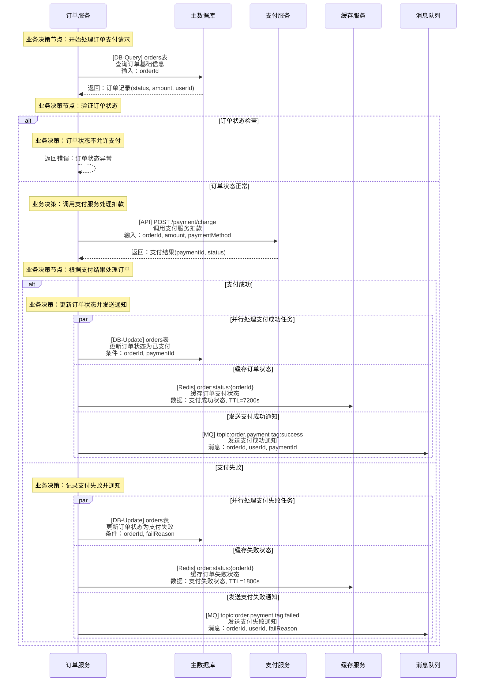
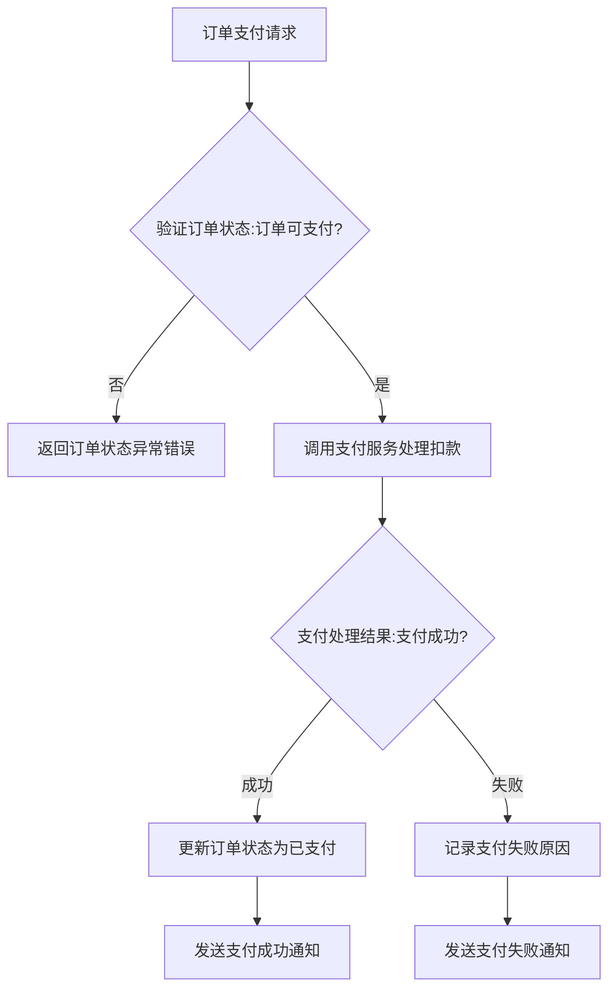

# API接口分析演示

这是基于接口逻辑可视化的演示文档，展示如何将复杂的API接口逻辑通过图表清晰地呈现出来。

## 演示接口：订单支付处理

### 接口基础信息
- **接口路径**：POST /api/v1/orders/pay
- **服务名称**：订单服务
- **功能描述**：处理订单支付请求，调用支付服务完成扣款
- **请求参数**：
  - orderId：string - 订单ID
  - paymentMethod：string - 支付方式（alipay/wechat/card）
  - amount：number - 支付金额（分为单位）
- **响应结构**：
  - success：boolean - 支付是否成功
  - orderId：string - 订单ID
  - paymentId：string - 支付流水号
  - message：string - 处理结果描述

## 技术调用时序图（完整流程）

## 业务逻辑流程图（简化版）

注意：此流程图从上方技术时序图中提取，只保留业务决策节点。

**从时序图提取对应关系**：
- B节点 ↔️ 时序图中"业务决策节点：验证订单状态"
- D节点 ↔️ 时序图中"业务决策：调用支付服务处理扣款"
- E节点 ↔️ 时序图中"业务决策节点：根据支付结果处理订单"
- F节点 ↔️ 时序图中"业务决策：更新订单状态并发送通知"
- G节点 ↔️ 时序图中"业务决策：记录支付失败并通知"
- H/I节点 ↔️ 时序图中支付成功/失败分支的通知处理

## 关键业务逻辑说明

- **状态验证**：先验证订单是否处于可支付状态
- **外部调用**：通过RPC调用支付服务处理实际扣款
- **状态更新**：根据支付结果同步更新订单状态
- **异步通知**：通过消息队列发送处理结果通知
